# Dany Fatihul Ihsan
# TI3B
# 06

## Praktikum 1: Dasar State dengan Model-View
### Langkah 1
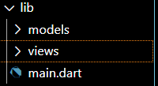

### Langkah 2
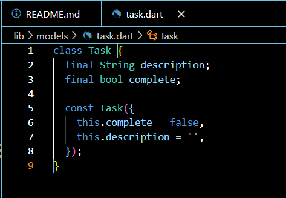

### Langkah 3
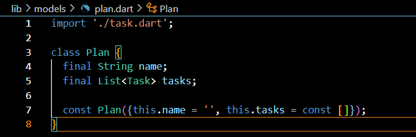

### Langkah 4
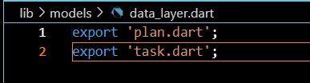

### Langkah 5
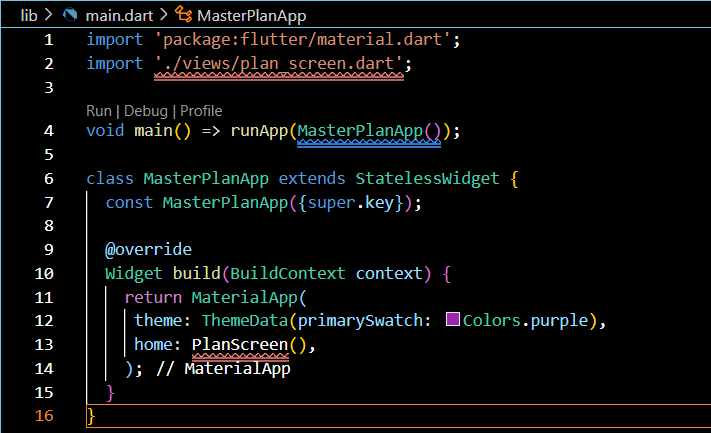

### Langkah 6
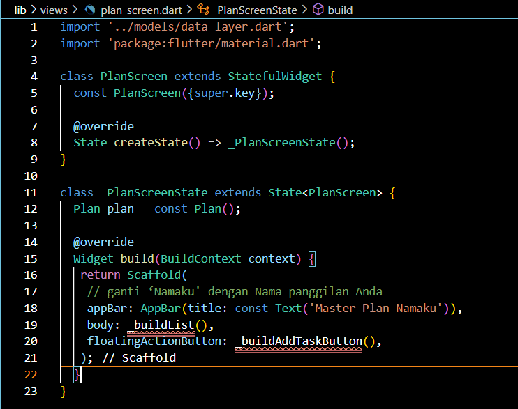

### Langkah 7
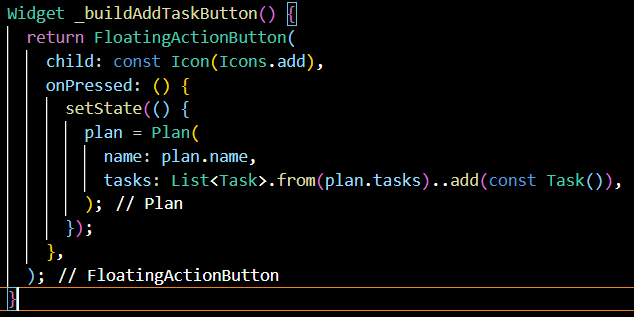

### Langkah 8
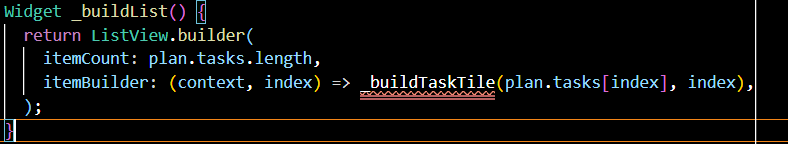

### Langkah 9
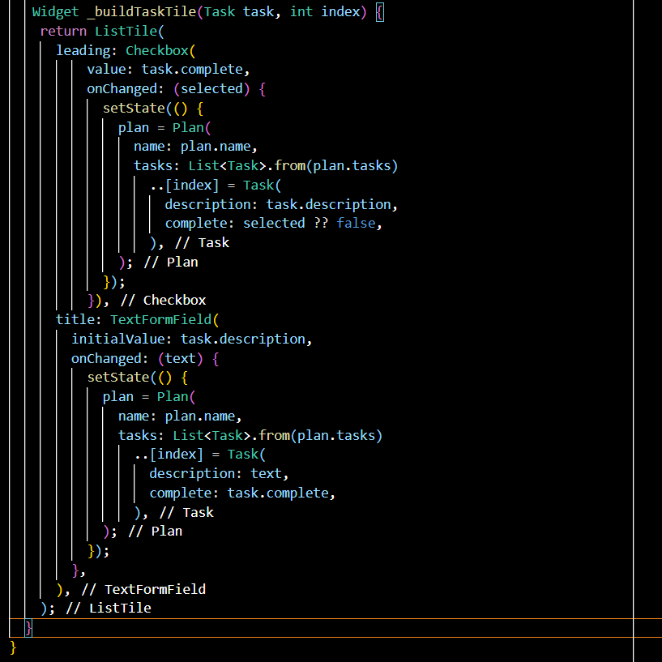

### Langkah 10
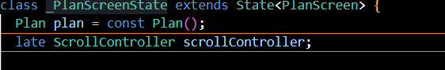

### Langkah 11
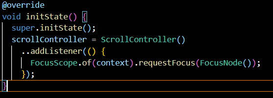

### Langkah 12
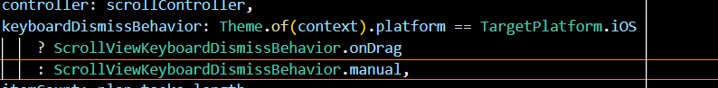

### Langkah 13
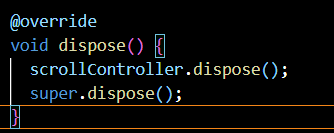

### Langkah 14
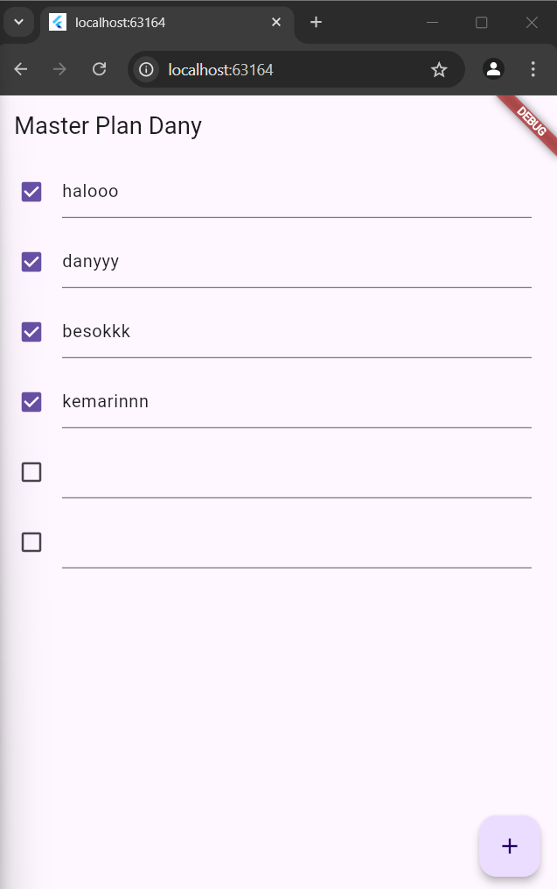

## Tugas Praktikum 1
1. Selesaikan langkah-langkah praktikum tersebut, lalu dokumentasikan berupa GIF hasil akhir praktikum beserta penjelasannya di file README.md! Jika Anda menemukan ada yang error atau tidak berjalan dengan baik, silakan diperbaiki.
2. Jelaskan maksud dari langkah 4 pada praktikum tersebut! Mengapa dilakukan demikian? 
* Jawab: Ini dilakukan agar modul atau fungsi di dalam file tersebut dapat digunakan di berbagai bagian lain dalam proyek tanpa menduplikasi kode. Dengan ekspor ini, developer dapat mengorganisir dan mengakses kode secara modular, mempermudah pemeliharaan dan pembaruan.

3. Mengapa perlu variabel plan di langkah 6 pada praktikum tersebut? Mengapa dibuat konstanta ?
* Jawab: Variabel plan digunakan untuk menyimpan data rencana yang ditampilkan pada PlanScreen. Variabel ini dibuat sebagai konstanta (const Plan()) karena objek awal ini tidak akan berubah selama siklus hidup PlanScreen, sehingga menghemat memori dan meningkatkan performa aplikasi.

4. Lakukan capture hasil dari Langkah 9 berupa GIF, kemudian jelaskan apa yang telah Anda buat!
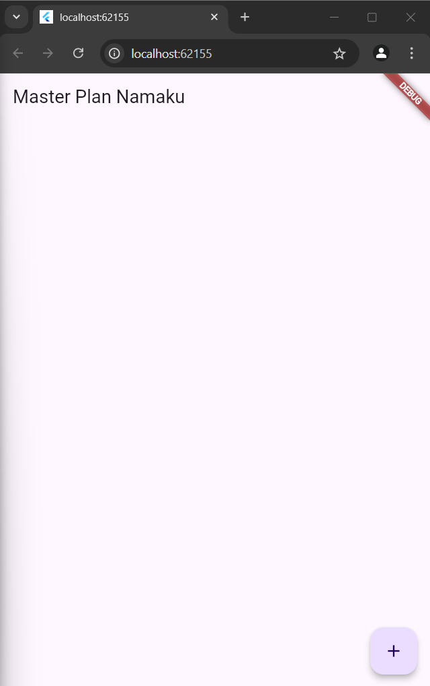

5. Apa kegunaan method pada Langkah 11 dan 13 dalam lifecyle state ?
* Jawab: Pada langkah 11, metode initState() digunakan untuk menginisialisasi scrollController saat PlanScreen pertama kali dibuat. Dengan menambahkan listener pada scrollController, setiap kali terjadi pergeseran pada tampilan (scroll), focus pada elemen yang aktif akan dilepaskan (FocusScope.of(context).requestFocus(FocusNode())). Ini berguna agar elemen-elemen, seperti text fields, tidak lagi dalam mode aktif saat pengguna menggulir layar, membantu menciptakan pengalaman pengguna yang lebih mulus. Pada langkah 13, metode dispose() digunakan untuk membersihkan scrollController ketika PlanScreen tidak lagi digunakan. Ini adalah langkah penting dalam lifecycle widget karena dispose() melepaskan sumber daya dan listeners yang mungkin masih terikat, sehingga mencegah kebocoran memori dan memastikan aplikasi berjalan lebih efisien.

6. Kumpulkan laporan praktikum Anda berupa link commit atau repository GitHub ke dosen yang telah disepakati !

## Praktikum 2: Mengelola Data Layer dengan InheritedWidget dan InheritedNotifier
### Langkah 1
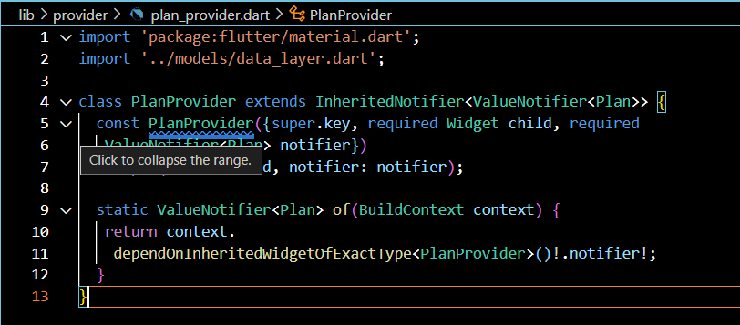

### Langkah 2
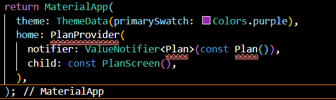

### Langkah 3
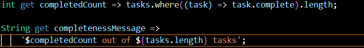

### Langkah 4
Edit PlanScreen agar menggunakan data dari PlanProvider. Hapus deklarasi variabel plan (ini akan membuat error). Kita akan perbaiki pada langkah 5 berikut ini.
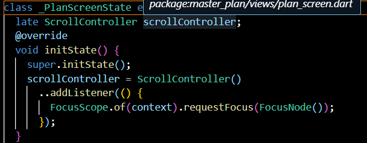

### Langkah 5
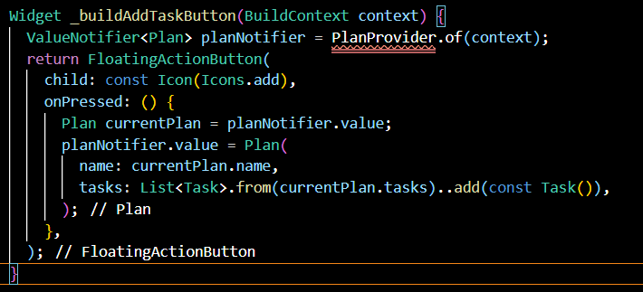

### Langkah 6
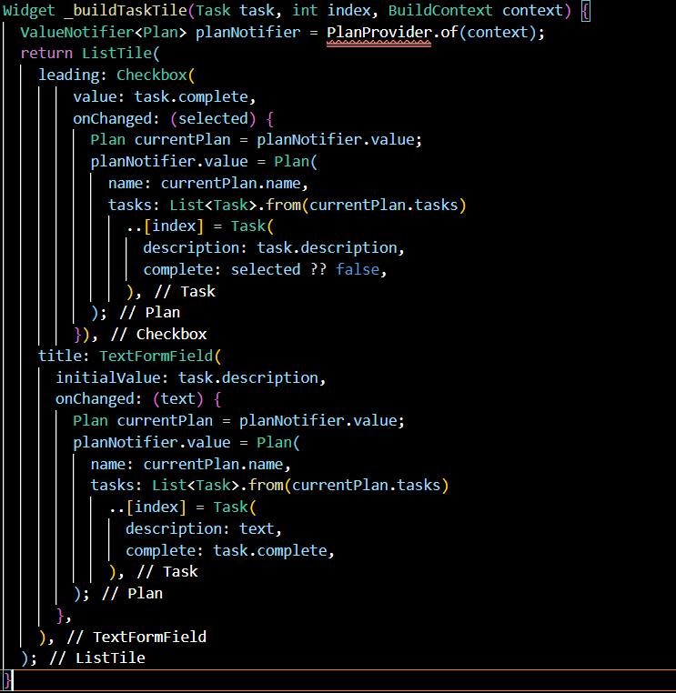

### Langkah 7
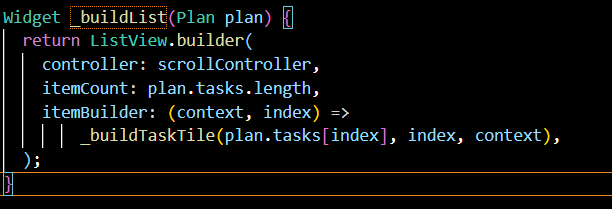

### Langkah 8
Edit method build sehingga bisa tampil progress pada bagian bawah (footer). Caranya, bungkus (wrap) _buildList dengan widget Expanded dan masukkan ke dalam widget Column seperti kode pada Langkah 9.

### Langkah 9
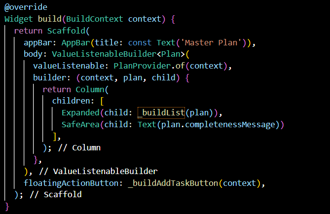
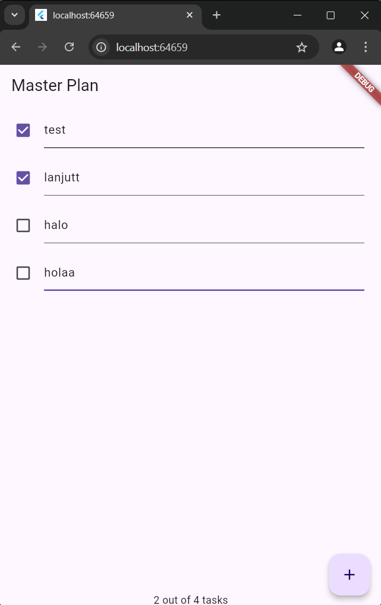

## Tugas Praktikum 2
1. Selesaikan langkah-langkah praktikum tersebut, lalu dokumentasikan berupa GIF hasil akhir praktikum beserta penjelasannya di file README.md! Jika Anda menemukan ada yang error atau tidak berjalan dengan baik, silakan diperbaiki sesuai dengan tujuan aplikasi tersebut dibuat.

2. Jelaskan mana yang dimaksud InheritedWidget pada langkah 1 tersebut! Mengapa yang digunakan InheritedNotifier?
* Jawab: Pada langkah 1, PlanProvider adalah turunan InheritedNotifier, yang digunakan untuk membagikan data ValueNotifier ke widget-widget turunan secara efisien. Dengan InheritedNotifier, setiap perubahan pada ValueNotifier akan otomatis memperbarui widget-widget terkait tanpa perlu melewatkan data secara langsung. Ini lebih efisien dibandingkan InheritedWidget biasa, karena InheritedNotifier hanya merender ulang widget yang memerlukan data ketika terjadi perubahan, sehingga membuat aplikasi lebih responsif.

3. Jelaskan maksud dari method di langkah 3 pada praktikum tersebut! Mengapa dilakukan demikian?
* Jawab: Pada langkah 3, dua metode baru ditambahkan ke kelas model Plan untuk menghitung dan menampilkan progres penyelesaian tugas. Metode completedCount menghitung jumlah tugas yang sudah selesai, sedangkan completenessMessage menghasilkan pesan yang menunjukkan berapa banyak tugas yang telah diselesaikan dibandingkan dengan total tugas. Penambahan metode ini memudahkan pengguna untuk melihat status penyelesaian tugas secara langsung.

4. Lakukan capture hasil dari Langkah 9 berupa GIF, kemudian jelaskan apa yang telah Anda buat!
* Jawab: Terdapat task yang sudah dan total semua task

5. Kumpulkan laporan praktikum Anda berupa link commit atau repository GitHub ke dosen yang telah disepakati !

## Praktikum 3: Membuat State di Multiple Screens
### Langkah 1
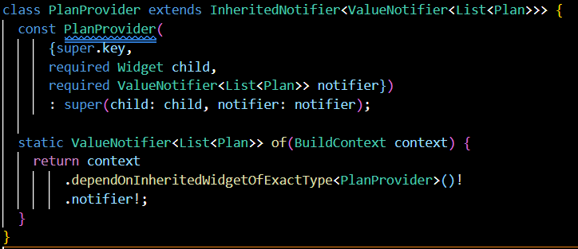

### Langkah 2
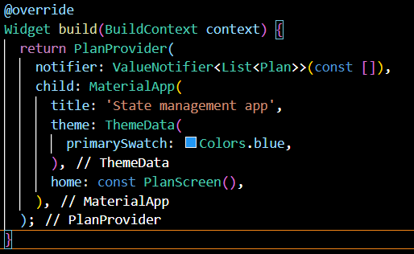

### Langkah 3
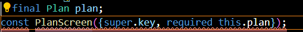

### Langkah 4
Itu akan terjadi error setiap kali memanggil PlanProvider.of(context). Itu terjadi karena screen saat ini hanya menerima tugas-tugas untuk satu kelompok Plan, tapi sekarang PlanProvider menjadi list dari objek plan tersebut.

### Langkah 5
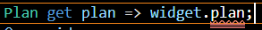

### Langkah 6
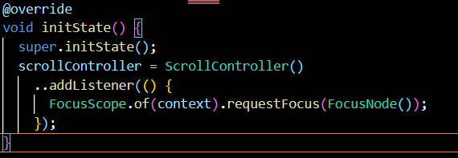

### Langkah 7
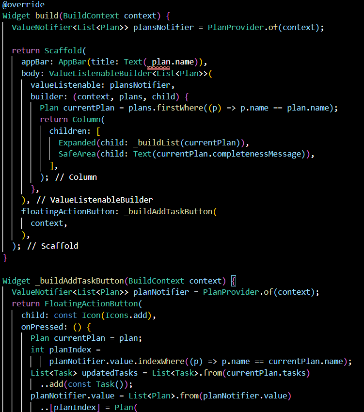

### Langkah 8
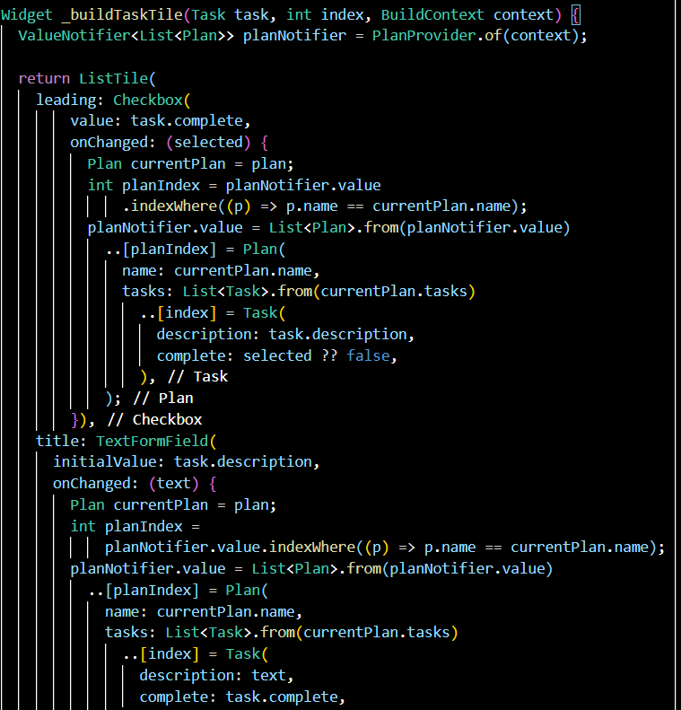

### Langkah 9
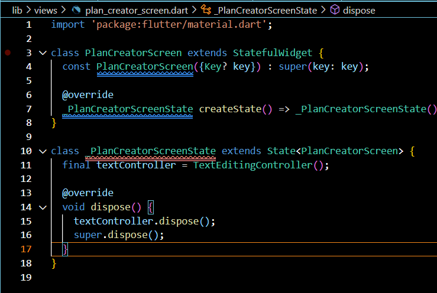

### Langkah 10
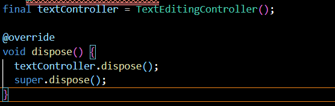

### Langkah 11
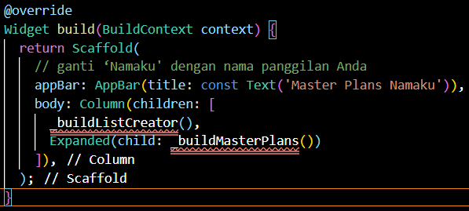

### Langkah 12
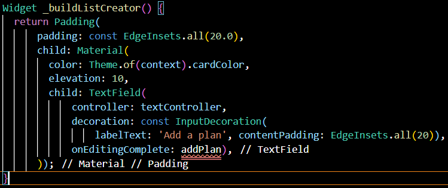

### Langkah 13
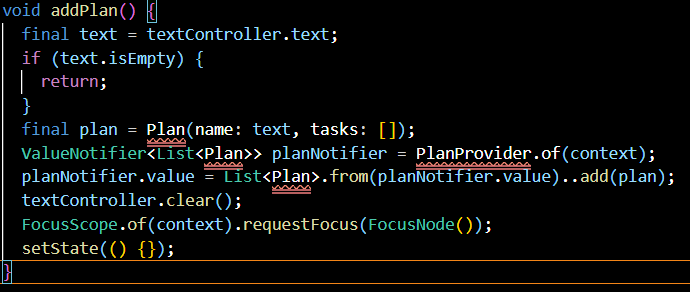

### Langkah 14
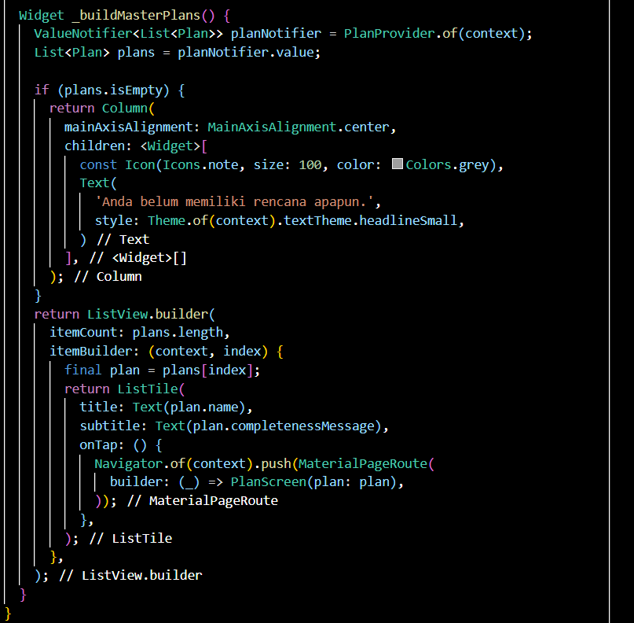
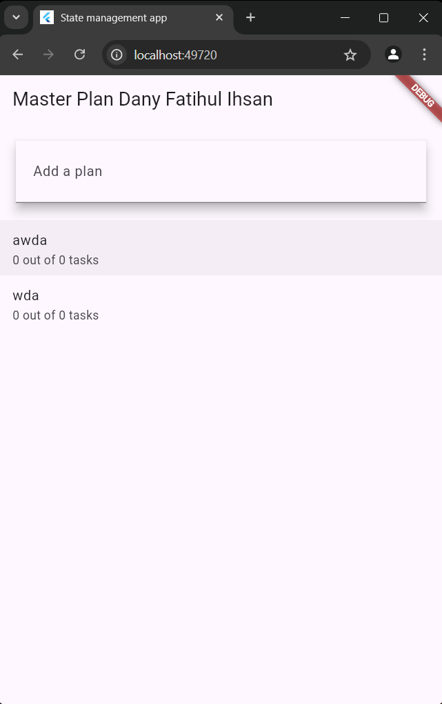

## Tugas Praktikum 3
1. Selesaikan langkah-langkah praktikum tersebut, lalu dokumentasikan berupa GIF hasil akhir praktikum beserta penjelasannya di file README.md! Jika Anda menemukan ada yang error atau tidak berjalan dengan baik, silakan diperbaiki sesuai dengan tujuan aplikasi tersebut dibuat.
2. Berdasarkan Praktikum 3 yang telah Anda lakukan, jelaskan maksud dari gambar diagram berikut ini!
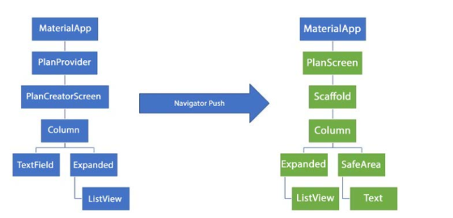
* Jawab: Diagram tersebut menunjukkan perbedaan struktur widget antara dua layar dalam aplikasi Flutter yang diakses melalui navigasi Navigator.push. Di bagian kiri, struktur awal aplikasi dimulai dengan MaterialApp, diikuti oleh PlanProvider sebagai penyedia data, dan kemudian PlanCreatorScreen sebagai layar utama. Di dalam PlanCreatorScreen, terdapat struktur Column yang terdiri dari TextField untuk input teks dan Expanded yang menampung ListView untuk menampilkan daftar item secara scrollable. Pada bagian kanan, setelah pengguna melakukan navigasi ke layar PlanScreen dengan Navigator.push, terdapat perubahan struktur widget. PlanScreen menggunakan Scaffold sebagai dasar tata letak untuk menyediakan elemen-elemen seperti AppBar dan FloatingActionButton. Di dalam Scaffold, terdapat Column yang berisi Expanded untuk menampung ListView dan SafeArea yang mengelilingi widget Text. Penggunaan SafeArea di layar baru ini menunjukkan perhatian terhadap kenyamanan tampilan di berbagai perangkat, menghindari area yang mungkin terpotong atau terganggu oleh notch atau elemen layar lainnya. Secara keseluruhan, navigasi ini memungkinkan pemisahan dan pengorganisasian elemen UI yang lebih baik, sehingga aplikasi menjadi lebih modular, responsif, dan nyaman diakses oleh pengguna.
3. Lakukan capture hasil dari Langkah 14 berupa GIF, kemudian jelaskan apa yang telah Anda buat!
4. Kumpulkan laporan praktikum Anda berupa link commit atau repository GitHub ke dosen yang telah disepakati !