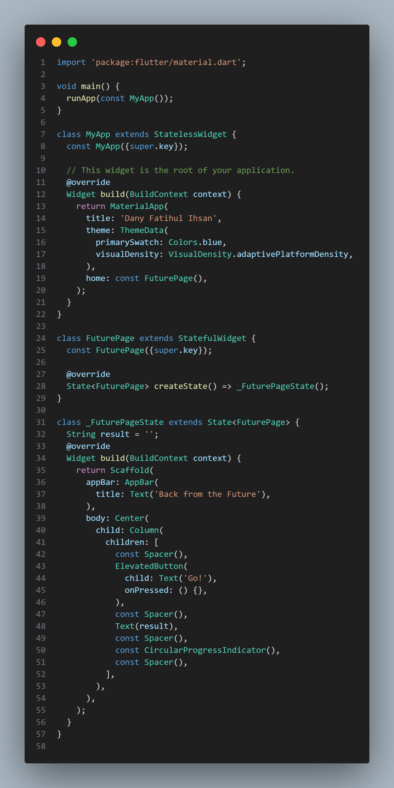
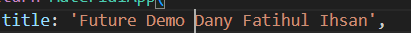
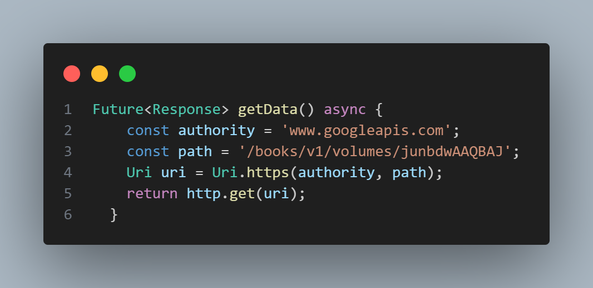
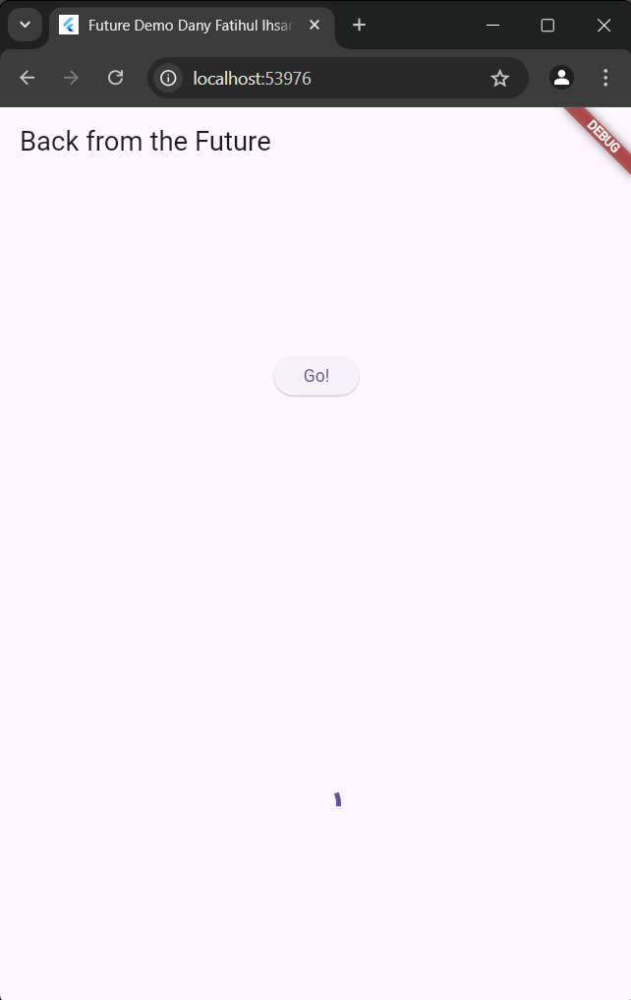
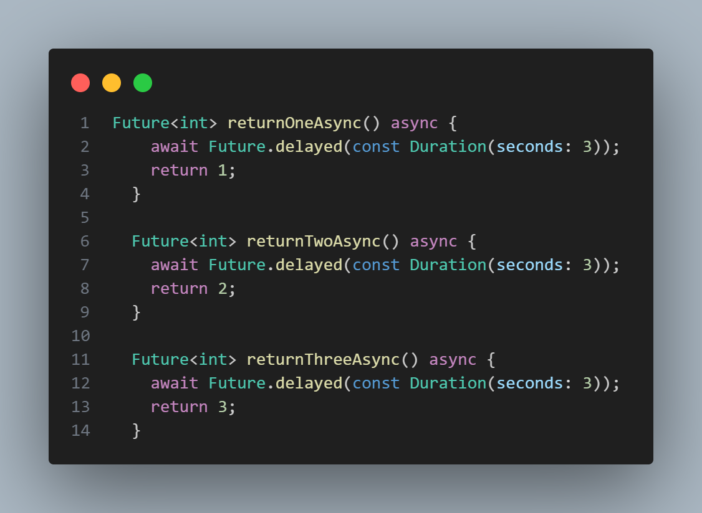
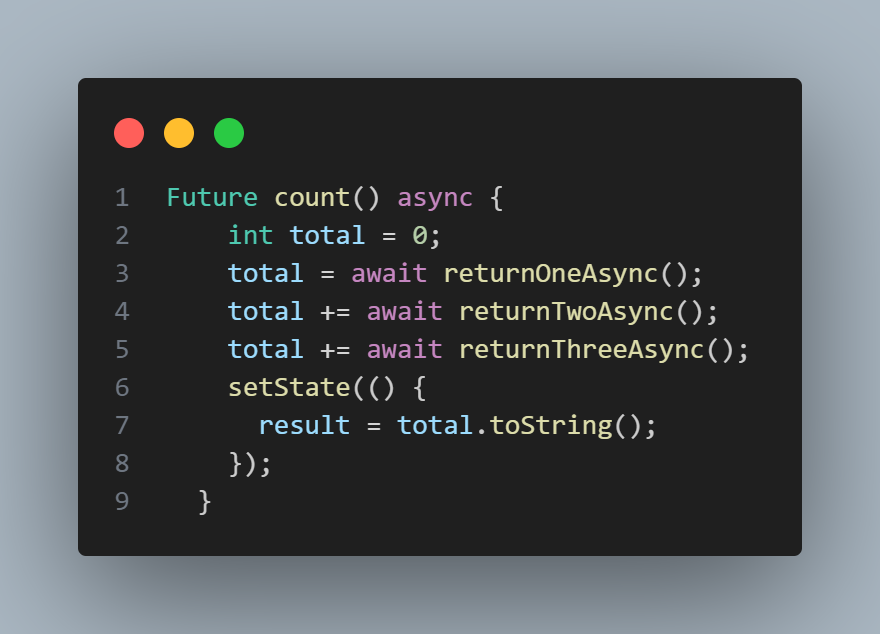
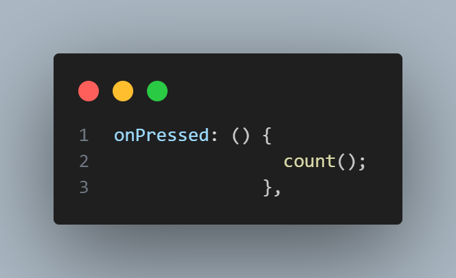
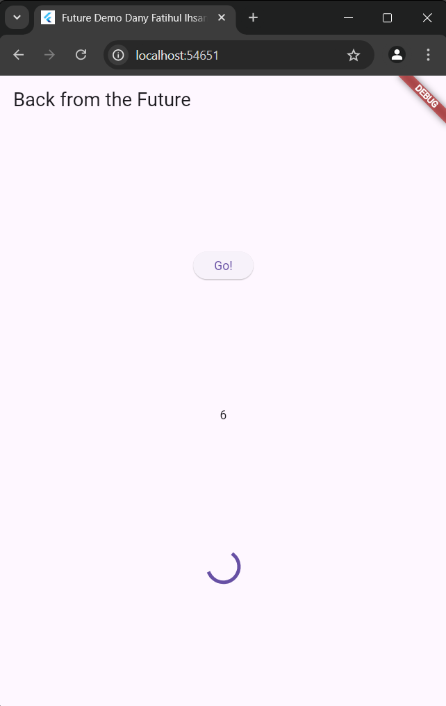

# Dany Fatihul Ihsan
# TI3B
# 06

## 11 | Pemrograman Asynchronous
### Praktikum 1: Mengunduh Data dari Web Service (API)
#### Langkah 1 Buat Project Baru
```text
flutter pub add http
```

#### Langkah 2 Cek file pubspec.yaml


#### Langkah 3: Buka file main.dart
Ketiklah kode seperti berikut ini.


Soal 1
Tambahkan nama panggilan Anda pada title app sebagai identitas hasil pekerjaan Anda.


#### Langkah 4: Tambah method getData()
Tambahkan method ini ke dalam class _FuturePageState yang berguna untuk mengambil data dari API Google Books.


#### Soal 2
Carilah judul buku favorit Anda di Google Books, lalu ganti ID buku pada variabel path di kode tersebut. Caranya ambil di URL browser Anda seperti gambar berikut ini.

Kemudian cobalah akses di browser URI tersebut dengan lengkap seperti ini. Jika menampilkan data JSON, maka Anda telah berhasil. Lakukan capture milik Anda dan tulis di README pada laporan praktikum. Lalu lakukan commit dengan pesan "W11: Soal 2".


#### Langkah 5: Tambah kode di ElevatedButton
Tambahkan kode pada onPressed di ElevatedButton seperti berikut.


#### Soal 3
Jelaskan maksud kode langkah 5 tersebut terkait substring dan catchError!
Jawab: Ketika tombol ditekan, fungsi getData() dipanggil untuk mengambil data buku, dan hanya 450 karakter pertama dari body respon yang ditampilkan menggunakan substring. Jika permintaan berhasil, hasilnya ditampilkan; jika terjadi kesalahan, blok catchError menangani error tersebut dengan menampilkan pesan 'An Error Occurred'. setState digunakan untuk memperbarui tampilan setelah hasil permintaan diterima atau jika terjadi kesalahan, dan CircularProgressIndicator ditambahkan sebagai indikator pemrosesan.

Capture hasil praktikum Anda berupa GIF dan lampirkan di README. Lalu lakukan commit dengan pesan "W11: Soal 3".


### Praktikum 2: Menggunakan await/async untuk menghindari callbacks
#### Langkah 1: Buka file main.dart
Tambahkan tiga method berisi kode seperti berikut di dalam class _FuturePageState.


#### Langkah 2: Tambah method count()
Lalu tambahkan lagi method ini di bawah ketiga method sebelumnya.


#### Langkah 3: Panggil count()
Lakukan comment kode sebelumnya, ubah isi kode onPressed() menjadi seperti berikut.


#### Langkah 4: Run
Akhirnya, run atau tekan F5 jika aplikasi belum running. Maka Anda akan melihat seperti gambar berikut, hasil angka 6 akan tampil setelah delay 9 detik.


#### Soal 4
Jelaskan maksud kode langkah 1 dan 2 tersebut!
Jawab: 
* Future<int> menunjukkan bahwa fungsi ini mengembalikan objek Future yang menghasilkan nilai integer (int).
* await Future.delayed(const Duration(seconds: 3)); menyebabkan fungsi ini menunggu selama 3 detik (mewakili penundaan atau operasi asinkron lainnya).
* Setelah 3 detik, fungsi mengembalikan nilai integer (1, 2, atau 3 tergantung pada fungsinya).
* Fungsi count adalah fungsi asinkron yang tidak mengembalikan nilai (void).
* int total = 0; mendeklarasikan dan menginisialisasi variabel total dengan nilai 0.
* total = await returnOneAsync(); menunggu sampai returnOneAsync selesai dan mengembalikan nilai 1, yang kemudian disimpan dalam total.
* total += await returnTwoAsync(); menunggu sampai returnTwoAsync selesai dan menambahkan nilai 2 ke total.
* total += await returnThreeAsync(); menunggu sampai returnThreeAsyncselesai dan menambahkan nilai 3 ke total.
* Setelah semua operasi selesai, fungsi setState digunakan untuk memperbarui tampilan dengan mengubah nilai result menjadi total dari ketiga nilai tersebut dalam bentuk string.

Capture hasil praktikum Anda berupa GIF dan lampirkan di README. Lalu lakukan commit dengan pesan "W11: Soal 4".
