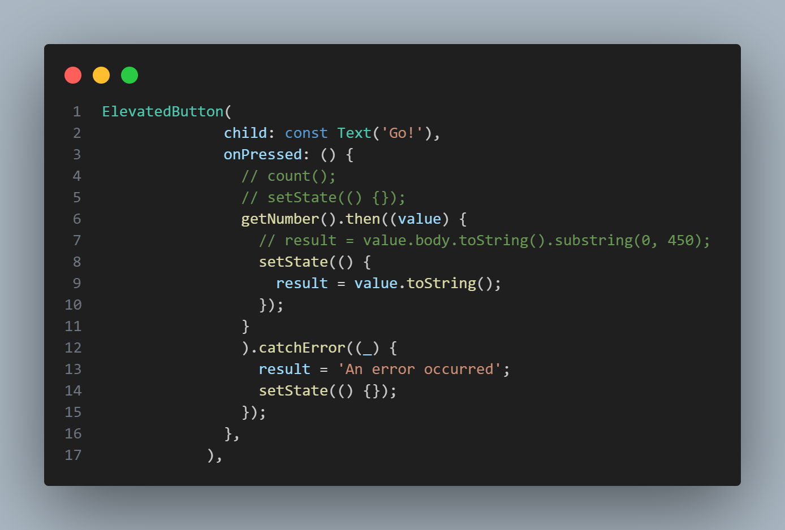

# Dany Fatihul Ihsan
# TI3B
# 06

## 11 | Pemrograman Asynchronous
### Praktikum 1: Mengunduh Data dari Web Service (API)
#### Langkah 1 Buat Project Baru
```text
flutter pub add http
```

#### Langkah 2 Cek file pubspec.yaml


#### Langkah 3: Buka file main.dart
Ketiklah kode seperti berikut ini.


Soal 1
Tambahkan nama panggilan Anda pada title app sebagai identitas hasil pekerjaan Anda.


#### Langkah 4: Tambah method getData()
Tambahkan method ini ke dalam class _FuturePageState yang berguna untuk mengambil data dari API Google Books.


#### Soal 2
Carilah judul buku favorit Anda di Google Books, lalu ganti ID buku pada variabel path di kode tersebut. Caranya ambil di URL browser Anda seperti gambar berikut ini.

Kemudian cobalah akses di browser URI tersebut dengan lengkap seperti ini. Jika menampilkan data JSON, maka Anda telah berhasil. Lakukan capture milik Anda dan tulis di README pada laporan praktikum. Lalu lakukan commit dengan pesan "W11: Soal 2".


#### Langkah 5: Tambah kode di ElevatedButton
Tambahkan kode pada onPressed di ElevatedButton seperti berikut.


#### Soal 3
Jelaskan maksud kode langkah 5 tersebut terkait substring dan catchError!
Jawab: Ketika tombol ditekan, fungsi getData() dipanggil untuk mengambil data buku, dan hanya 450 karakter pertama dari body respon yang ditampilkan menggunakan substring. Jika permintaan berhasil, hasilnya ditampilkan; jika terjadi kesalahan, blok catchError menangani error tersebut dengan menampilkan pesan 'An Error Occurred'. setState digunakan untuk memperbarui tampilan setelah hasil permintaan diterima atau jika terjadi kesalahan, dan CircularProgressIndicator ditambahkan sebagai indikator pemrosesan.

Capture hasil praktikum Anda berupa GIF dan lampirkan di README. Lalu lakukan commit dengan pesan "W11: Soal 3".


### Praktikum 2: Menggunakan await/async untuk menghindari callbacks
#### Langkah 1: Buka file main.dart
Tambahkan tiga method berisi kode seperti berikut di dalam class _FuturePageState.


#### Langkah 2: Tambah method count()
Lalu tambahkan lagi method ini di bawah ketiga method sebelumnya.


#### Langkah 3: Panggil count()
Lakukan comment kode sebelumnya, ubah isi kode onPressed() menjadi seperti berikut.


#### Langkah 4: Run
Akhirnya, run atau tekan F5 jika aplikasi belum running. Maka Anda akan melihat seperti gambar berikut, hasil angka 6 akan tampil setelah delay 9 detik.


#### Soal 4
Jelaskan maksud kode langkah 1 dan 2 tersebut!
Jawab: 
* Future<int> menunjukkan bahwa fungsi ini mengembalikan objek Future yang menghasilkan nilai integer (int).
* await Future.delayed(const Duration(seconds: 3)); menyebabkan fungsi ini menunggu selama 3 detik (mewakili penundaan atau operasi asinkron lainnya).
* Setelah 3 detik, fungsi mengembalikan nilai integer (1, 2, atau 3 tergantung pada fungsinya).
* Fungsi count adalah fungsi asinkron yang tidak mengembalikan nilai (void).
* int total = 0; mendeklarasikan dan menginisialisasi variabel total dengan nilai 0.
* total = await returnOneAsync(); menunggu sampai returnOneAsync selesai dan mengembalikan nilai 1, yang kemudian disimpan dalam total.
* total += await returnTwoAsync(); menunggu sampai returnTwoAsync selesai dan menambahkan nilai 2 ke total.
* total += await returnThreeAsync(); menunggu sampai returnThreeAsyncselesai dan menambahkan nilai 3 ke total.
* Setelah semua operasi selesai, fungsi setState digunakan untuk memperbarui tampilan dengan mengubah nilai result menjadi total dari ketiga nilai tersebut dalam bentuk string.

Capture hasil praktikum Anda berupa GIF dan lampirkan di README. Lalu lakukan commit dengan pesan "W11: Soal 4".


### Praktikum 3: Menggunakan Completer di Future
#### Langkah 1: Buka main.dart
Pastikan telah impor package async berikut.


#### Langkah 2: Tambahkan variabel dan method
Tambahkan variabel late dan method di class _FuturePageState seperti ini.


#### Langkah 3: Ganti isi kode onPressed()
Tambahkan kode berikut pada fungsi onPressed(). Kode sebelumnya bisa Anda comment.


#### Langkah 4:
Terakhir, run atau tekan F5 untuk melihat hasilnya jika memang belum running. Bisa juga lakukan hot restart jika aplikasi sudah running. Maka hasilnya akan seperti gambar berikut ini. Setelah 5 detik, maka angka 42 akan tampil.


#### Soal 5
Jelaskan maksud kode langkah 2 tersebut!
* Completer dideklarasikan dengan keyword late, yang berarti bahwa variabel ini akan diinisialisasi nanti sebelum digunakan.
* Fungsi ini mengembalikan sebuah Future.
* completer = Completer(); membuat instance baru dari Completer yang menghasilkan Future yang akan menghasilkan nilai integer (int).
* calculate(); memanggil fungsi calculate untuk memulai perhitungan asinkron.
* return completer.future; mengembalikan Future yang terkait dengan Completer ini.
* Fungsi ini menunggu selama 5 detik menggunakan Future.delayed.
* Setelah 5 detik, completer.complete(42); memanggil metode complete dari Completer untuk menyelesaikan Future yang terkait dan mengirimkan nilai 42.

Capture hasil praktikum Anda berupa GIF dan lampirkan di README. Lalu lakukan commit dengan pesan "W11: Soal 5".


#### Langkah 5: Ganti method calculate()
Gantilah isi code method calculate() seperti kode berikut, atau Anda dapat membuat calculate2()


#### Langkah 6: Pindah ke onPressed()
Ganti menjadi kode seperti berikut.


#### Soal 6
Jelaskan maksud perbedaan kode langkah 2 dengan langkah 5-6 tersebut!
* Kode pertama tidak memiliki penanganan kesalahan, sehingga jika terjadi kesalahan dalam operasi asinkron, aplikasi mungkin mengalami crash atau perilaku tidak terduga.
* Kode kedua menggunakan blok try-catch untuk menangani kesalahan dan menyelesaikan Completer dengan error, memungkinkan penanganan kesalahan lebih baik.

Capture hasil praktikum Anda berupa GIF dan lampirkan di README. Lalu lakukan commit dengan pesan "W11: Soal 6".
