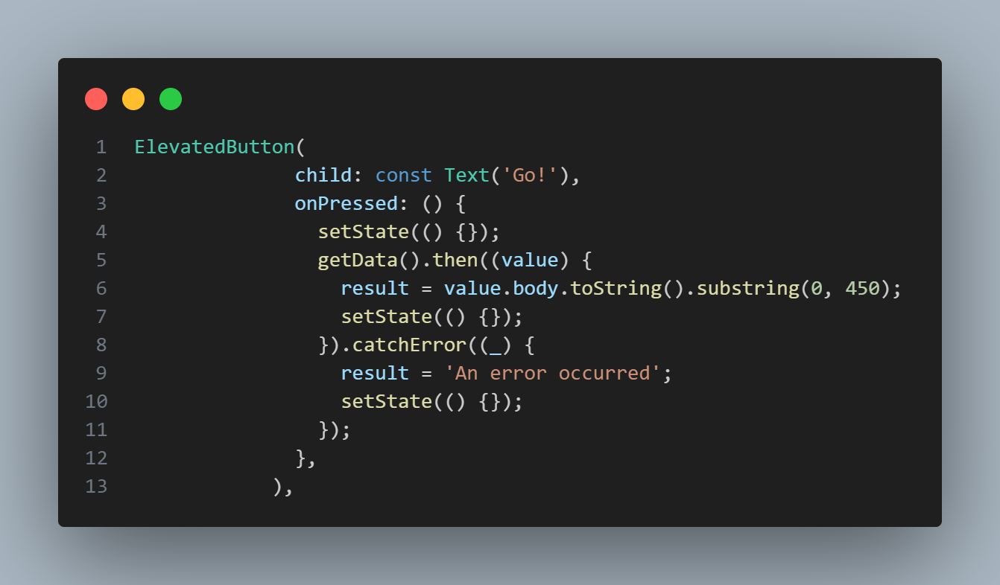

# Dany Fatihul Ihsan
# TI3B
# 06

## 11 | Pemrograman Asynchronous
### Praktikum 1: Mengunduh Data dari Web Service (API)
#### Langkah 1 Buat Project Baru
```text
flutter pub add http
```

#### Langkah 2 Cek file pubspec.yaml


#### Langkah 3: Buka file main.dart
Ketiklah kode seperti berikut ini.


Soal 1
Tambahkan nama panggilan Anda pada title app sebagai identitas hasil pekerjaan Anda.


#### Langkah 4: Tambah method getData()
Tambahkan method ini ke dalam class _FuturePageState yang berguna untuk mengambil data dari API Google Books.


#### Soal 2
Carilah judul buku favorit Anda di Google Books, lalu ganti ID buku pada variabel path di kode tersebut. Caranya ambil di URL browser Anda seperti gambar berikut ini.

Kemudian cobalah akses di browser URI tersebut dengan lengkap seperti ini. Jika menampilkan data JSON, maka Anda telah berhasil. Lakukan capture milik Anda dan tulis di README pada laporan praktikum. Lalu lakukan commit dengan pesan "W11: Soal 2".


#### Langkah 5: Tambah kode di ElevatedButton
Tambahkan kode pada onPressed di ElevatedButton seperti berikut.


#### Soal 3
Jelaskan maksud kode langkah 5 tersebut terkait substring dan catchError!
Jawab: Ketika tombol ditekan, fungsi getData() dipanggil untuk mengambil data buku, dan hanya 450 karakter pertama dari body respon yang ditampilkan menggunakan substring. Jika permintaan berhasil, hasilnya ditampilkan; jika terjadi kesalahan, blok catchError menangani error tersebut dengan menampilkan pesan 'An Error Occurred'. setState digunakan untuk memperbarui tampilan setelah hasil permintaan diterima atau jika terjadi kesalahan, dan CircularProgressIndicator ditambahkan sebagai indikator pemrosesan.

Capture hasil praktikum Anda berupa GIF dan lampirkan di README. Lalu lakukan commit dengan pesan "W11: Soal 3".


### Praktikum 2: Menggunakan await/async untuk menghindari callbacks
#### Langkah 1: Buka file main.dart
Tambahkan tiga method berisi kode seperti berikut di dalam class _FuturePageState.


#### Langkah 2: Tambah method count()
Lalu tambahkan lagi method ini di bawah ketiga method sebelumnya.


#### Langkah 3: Panggil count()
Lakukan comment kode sebelumnya, ubah isi kode onPressed() menjadi seperti berikut.


#### Langkah 4: Run
Akhirnya, run atau tekan F5 jika aplikasi belum running. Maka Anda akan melihat seperti gambar berikut, hasil angka 6 akan tampil setelah delay 9 detik.


#### Soal 4
Jelaskan maksud kode langkah 1 dan 2 tersebut!
Jawab: 
* Future<int> menunjukkan bahwa fungsi ini mengembalikan objek Future yang menghasilkan nilai integer (int).
* await Future.delayed(const Duration(seconds: 3)); menyebabkan fungsi ini menunggu selama 3 detik (mewakili penundaan atau operasi asinkron lainnya).
* Setelah 3 detik, fungsi mengembalikan nilai integer (1, 2, atau 3 tergantung pada fungsinya).
* Fungsi count adalah fungsi asinkron yang tidak mengembalikan nilai (void).
* int total = 0; mendeklarasikan dan menginisialisasi variabel total dengan nilai 0.
* total = await returnOneAsync(); menunggu sampai returnOneAsync selesai dan mengembalikan nilai 1, yang kemudian disimpan dalam total.
* total += await returnTwoAsync(); menunggu sampai returnTwoAsync selesai dan menambahkan nilai 2 ke total.
* total += await returnThreeAsync(); menunggu sampai returnThreeAsyncselesai dan menambahkan nilai 3 ke total.
* Setelah semua operasi selesai, fungsi setState digunakan untuk memperbarui tampilan dengan mengubah nilai result menjadi total dari ketiga nilai tersebut dalam bentuk string.

Capture hasil praktikum Anda berupa GIF dan lampirkan di README. Lalu lakukan commit dengan pesan "W11: Soal 4".


### Praktikum 3: Menggunakan Completer di Future
#### Langkah 1: Buka main.dart
Pastikan telah impor package async berikut.


#### Langkah 2: Tambahkan variabel dan method
Tambahkan variabel late dan method di class _FuturePageState seperti ini.


#### Langkah 3: Ganti isi kode onPressed()
Tambahkan kode berikut pada fungsi onPressed(). Kode sebelumnya bisa Anda comment.


#### Langkah 4:
Terakhir, run atau tekan F5 untuk melihat hasilnya jika memang belum running. Bisa juga lakukan hot restart jika aplikasi sudah running. Maka hasilnya akan seperti gambar berikut ini. Setelah 5 detik, maka angka 42 akan tampil.


#### Soal 5
Jelaskan maksud kode langkah 2 tersebut!
* Completer dideklarasikan dengan keyword late, yang berarti bahwa variabel ini akan diinisialisasi nanti sebelum digunakan.
* Fungsi ini mengembalikan sebuah Future.
* completer = Completer(); membuat instance baru dari Completer yang menghasilkan Future yang akan menghasilkan nilai integer (int).
* calculate(); memanggil fungsi calculate untuk memulai perhitungan asinkron.
* return completer.future; mengembalikan Future yang terkait dengan Completer ini.
* Fungsi ini menunggu selama 5 detik menggunakan Future.delayed.
* Setelah 5 detik, completer.complete(42); memanggil metode complete dari Completer untuk menyelesaikan Future yang terkait dan mengirimkan nilai 42.

Capture hasil praktikum Anda berupa GIF dan lampirkan di README. Lalu lakukan commit dengan pesan "W11: Soal 5".


#### Langkah 5: Ganti method calculate()
Gantilah isi code method calculate() seperti kode berikut, atau Anda dapat membuat calculate2()


#### Langkah 6: Pindah ke onPressed()
Ganti menjadi kode seperti berikut.


#### Soal 6
Jelaskan maksud perbedaan kode langkah 2 dengan langkah 5-6 tersebut!
* Kode pertama tidak memiliki penanganan kesalahan, sehingga jika terjadi kesalahan dalam operasi asinkron, aplikasi mungkin mengalami crash atau perilaku tidak terduga.
* Kode kedua menggunakan blok try-catch untuk menangani kesalahan dan menyelesaikan Completer dengan error, memungkinkan penanganan kesalahan lebih baik.

Capture hasil praktikum Anda berupa GIF dan lampirkan di README. Lalu lakukan commit dengan pesan "W11: Soal 6".


### Praktikum 4: Memanggil Future secara paralel
#### Langkah 1
Tambahkan method ini ke dalam class _FuturePageState


#### Langkah 2: Edit onPressed()
Anda bisa hapus atau comment kode sebelumnya, kemudian panggil method dari langkah 1 tersebut.


#### Langkah 3: Run
Anda akan melihat hasilnya dalam 3 detik berupa angka 6 lebih cepat dibandingkan praktikum sebelumnya menunggu sampai 9 detik.


#### Soal 7
Capture hasil praktikum Anda berupa GIF dan lampirkan di README. Lalu lakukan commit dengan pesan "W11: Soal 7".


#### Langkah 4: Ganti variabel futureGroup
Anda dapat menggunakan FutureGroup dengan Future.wait seperti kode berikut.


#### Soal 8
Jelaskan maksud perbedaan kode langkah 1 dan 4!
jawab: Perbedaan antara kode yang menggunakan FutureGroup dan Future.wait terletak pada cara mengelola beberapa operasi asinkron. FutureGroup adalah kelas khusus, mungkin berasal dari paket eksternal, yang memberikan kontrol lebih besar atas kelompok Future, memungkinkan penambahan Future secara dinamis dan pengelolaan hasil secara individual. Sementara itu, Future.wait adalah metode bawaan Dart yang menerima daftar Future dan mengembalikan sebuah Future baru yang selesai ketika semua Future dalam daftar selesai, dengan hasilnya dikumpulkan dalam sebuah List. FutureGroup lebih cocok untuk skenario yang membutuhkan kontrol lebih rinci, sedangkan Future.wait lebih sederhana dan langsung digunakan ketika hanya perlu menunggu beberapa Future selesai dan mengumpulkan hasilnya.

### Praktikum 5: Menangani Respon Error pada Async Code
#### Langkah 1: Buka file main.dart
Tambahkan method ini ke dalam class _FuturePageState


#### Langkah 2: ElevatedButton
Ganti dengan kode berikut


#### Langkah 3: Run
Lakukan run dan klik tombol GO! maka akan menghasilkan seperti gambar berikut.


#### Soal 9
Capture hasil praktikum Anda berupa GIF dan lampirkan di README. Lalu lakukan commit dengan pesan "W11: Soal 9".


#### Langkah 4: Tambah method handleError()
Tambahkan kode ini di dalam class _FutureStatePage


#### Soal 10
Panggil method handleError() tersebut di ElevatedButton
 
lalu run. Apa hasilnya? 

Jelaskan perbedaan kode langkah 1 dan 4!
jawab: Perbedaan utama antara kedua kode tersebut terletak pada penanganan kesalahan. Kode pertama (returnError) hanya melemparkan exception tanpa penanganan, yang akan menyebabkan aplikasi terhenti jika terjadi error. Sementara kode kedua (handleError) menangani kesalahan dengan blok try-catch, di mana jika returnError melemparkan exception, kesalahan tersebut akan ditangkap dan ditangani dengan menampilkan pesan error melalui setState, yang memperbarui UI. Selain itu, kode kedua menggunakan blok finally, yang menjamin eksekusi kode setelah operasi selesai, baik berhasil maupun error, seperti mencetak "Complete". Dengan demikian, kode kedua lebih robust karena menangani kesalahan dan memastikan kelanjutan eksekusi program tanpa menyebabkan crash aplikasi.

### Praktikum 6: Menggunakan Future dengan StatefulWidget
#### Langkah 1: install plugin geolocator
Tambahkan plugin geolocator dengan mengetik perintah berikut di terminal.
```text
flutter pub add geolocator
```

#### Langkah 2: Tambah permission GPS
Jika Anda menargetkan untuk platform Android, maka tambahkan baris kode berikut di file android/app/src/main/androidmanifest.xml


#### Langkah 3: Buat file geolocation.dart
Tambahkan file baru ini di folder lib project Anda.

#### Langkah 4: Buat StatefulWidget
Buat class LocationScreen di dalam file geolocation.dart


#### Langkah 5: Isi kode geolocation.dart


#### Soal 11
Tambahkan nama panggilan Anda pada tiap properti title sebagai identitas pekerjaan Anda.


#### Langkah 6: Edit main.dart
Panggil screen baru tersebut di file main Anda seperti berikut.


#### Langkah 7: Run
Run project Anda di device atau emulator (bukan browser), maka akan tampil seperti berikut ini.
jawab: mohon maaf saya run pakai chrome saya pakai hp dan emu terdapat masalah tentang katlin yang versinya jauh lalu saya rubah versi 1.9.0 tidak bisa di run


#### Langkah 8: Tambahkan animasi loading
Tambahkan widget loading seperti kode berikut. Lalu hot restart, perhatikan perubahannya.


#### Soal 12
Jika Anda tidak melihat animasi loading tampil, kemungkinan itu berjalan sangat cepat. Tambahkan delay pada method getPosition() dengan kode await Future.delayed(const Duration(seconds: 3));


Apakah Anda mendapatkan koordinat GPS ketika run di browser? Mengapa demikian?
Saat menjalankan aplikasi Flutter di browser, Anda tidak akan mendapatkan koordinat GPS karena browser tidak mendukung akses langsung ke hardware GPS perangkat. Geolocator, seperti banyak plugin lainnya, bergantung pada API yang menyediakan akses ke sensor perangkat (seperti GPS pada perangkat mobile atau tablet). Namun, browser tidak memberikan akses langsung ke informasi lokasi perangkat fisik melalui API yang sama yang digunakan di perangkat Android atau iOS.

Capture hasil praktikum Anda berupa GIF dan lampirkan di README. Lalu lakukan commit dengan pesan "W11: Soal 12"

### Praktikum 7: Manajemen Future dengan FutureBuilder
#### Langkah 1: Modifikasi method getPosition()
Buka file geolocation.dart kemudian ganti isi method dengan kode ini.


#### Langkah 2: Tambah variabel
Tambah variabel ini di class _LocationScreenState


#### Langkah 3: Tambah initState()
Tambah method ini dan set variabel position


#### Langkah 4: Edit method build()
Ketik kode berikut dan sesuaikan. Kode lama bisa Anda comment atau hapus.


#### Soal 13
Apakah ada perbedaan UI dengan praktikum sebelumnya? Mengapa demikian?
Jawab: Tidak ada tetapi disini menggunakan FutureBuilder. FutureBuilder adalah widget yang dirancang untuk menangani operasi asinkron dan menampilkan data yang diperoleh secara dinamis. Dalam hal ini, saat aplikasi menunggu lokasi perangkat, akan muncul indikator pemuatan (loading) berupa CircularProgressIndicator.

Capture hasil praktikum Anda berupa GIF dan lampirkan di README. Lalu lakukan commit dengan pesan "W11: Soal 13".


Seperti yang Anda lihat, menggunakan FutureBuilder lebih efisien, clean, dan reactive dengan Future bersama UI.

#### Langkah 5: Tambah handling error
Tambahkan kode berikut untuk menangani ketika terjadi error. Kemudian hot restart.


#### Soal 14
Apakah ada perbedaan UI dengan langkah sebelumnya? Mengapa demikian?
Jawab: Untuk UI nya tidak berubah tetapi disini membuat kode baru untuk penanganan error. Pada kode yang baru, terdapat penanganan kesalahan (error handling) menggunakan snapshot.hasError di dalam FutureBuilder. Jika terjadi kesalahan saat mengambil data lokasi, maka aplikasi akan menampilkan pesan error "Something terrible happened!".


Capture hasil praktikum Anda berupa GIF dan lampirkan di README. Lalu lakukan commit dengan pesan "W11: Soal 14".