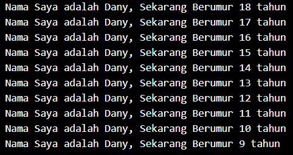

# Nama : Dany Fatihul Ihsan
# Kelas : TI3B / 06

## Tugas Praktikum
### Soal 1
Modifikasilah kode pada baris 3 di VS Code atau Editor Code favorit Anda berikut ini agar mendapatkan keluaran (output) 
sesuai yang diminta!

```dart
void main() {
    for (int = 0; i < 10;i++){
        print('hello $(i + 2)');
    }
}
```
Output yang diminta:



> Jawaban
```dart
void main() {
  for (int i = 18; i > 8; i--) {
    print('Nama Saya adalah Dany, Sekarang Berumur $i tahun');
  }
}
```

### Soal 2
Mengapa sangat penting untuk memahami bahasa pemrograman Dart sebelum kita menggunakan framework Flutter ? Jelaskan!
> Jawaban : Memahami bahasa pemrograman Dart sebelum menggunakan framework Flutter sangat penting karena Dart adalah bahasa yang mendasari penulisan aplikasi Flutter. Pemahaman tentang sintaks dan struktur Dart akan membantu Anda menulis kode yang lebih efisien. Selain itu Dart adalah bahasa berorientasi objek, pemahaman tentang konsep seperti kelas dan pewarisan akan memudahkan desain aplikasi. Banyak konsep di Flutter, seperti widget dan state management, bergantung pada pemahaman Dart. Keterampilan ini juga akan membantu dalam pemecahan masalah dan debugging. Terakhir, memahami Dart memungkinkan penulisan kode yang lebih optimal, meningkatkan kinerja aplikasi. Investasi waktu untuk mempelajari Dart memberikan fondasi yang kuat untuk pengembangan aplikasi Flutter.

### Soal 3
Rangkumlah materi dari codelab ini menjadi poin-poin penting yang dapat Anda gunakan untuk membantu proses pengembangan aplikasi mobile menggunakan framework Flutter.
> Jawaban :<br>
> 1. framework adalah bagian dari sebuah bangunan atau sebuah objek yang mendukung bobot dan memberikan suatu bentuk. Pengertian dari nomor dua menjelaskan bahwa framework adalah seperangkat panutan, ide atau aturan-aturan yang digunakan sebagai dasar untuk membuat hukum, keputusan, dsb.
> 2. Framework (kerangka kerja) adalah sebuah kerangka program yang digunakan untuk membantu developer dalam mengembangkan kode secara konsisten. Adanya framework developer bisa mengurangi jumlah bug pada aplikasi yang dibuat. Karena, fungsi dan variabel yang sudah tersedia di dalam komponen framework tersebut.
> 3. Git adalah salah satu sistem pengontrol versi (Version Control System) pada proyek perangkat lunak yang diciptakan oleh Linus Torvalds. Pengontrol versi bertugas mencatat setiap perubahan pada file proyek yang dikerjakan oleh banyak orang maupun sendiri. Git dikenal juga dengan distributed revision control (VCS terdistribusi), artinya penyimpanan database Git tidak hanya berada dalam satu tempat saja.
> 4. Flutter adalah pilihan yang sangat baik bagi pengembang yang ingin membuat aplikasi mobile, desktop, web, atau perangkat tertanam dengan cepat, efisien, dan berkualitas tinggi. Dengan mempelajari Flutter, Anda akan membuka banyak peluang untuk berkarya dan berinovasi dalam dunia pengembangan aplikasi.
> 5. Bahasa Dart adalah bahasa pemrograman inti dari framework Flutter, yang dirancang untuk menyediakan pengalaman pengembangan yang modern dan efisien. Untuk bekerja dengan Flutter, penting bagi pengembang untuk memahami Dart, termasuk asal-usul, kontribusi komunitas, kelebihan, dan alasan pemilihannya sebagai bahasa utama Flutter. Dalam codelab ini, Anda akan mempelajari dasar-dasar Dart, seperti tipe data dan operator bawaan, serta konsep pemrograman berorientasi objek (OOP) yang digunakan Dart. Dengan memahami bahasa Dart, Anda akan siap untuk bereksperimen dan mengembangkan aplikasi dengan Flutter.
> 6. Bahasa Dart adalah bahasa pemrograman inti dari framework Flutter, yang dirancang untuk menyediakan pengalaman pengembangan yang modern dan efisien. Untuk bekerja dengan Flutter, penting bagi pengembang untuk memahami Dart, termasuk asal-usul, kontribusi komunitas, kelebihan, dan alasan pemilihannya sebagai bahasa utama Flutter. Dalam codelab ini, Anda akan mempelajari dasar-dasar Dart, seperti tipe data dan operator bawaan, serta konsep pemrograman berorientasi objek (OOP) yang digunakan Dart. Dengan memahami bahasa Dart, Anda akan siap untuk bereksperimen dan mengembangkan aplikasi dengan Flutter.
> 7. Dart bertujuan untuk menggabungkan kelebihan-kelebihan dari sebagian besar bahasa tingkat tinggi dengan fitur-fitur bahasa pemrograman terkini, antara lain sebagai berikut:<br>
    a. Productive tooling: merupakan fitur kakas (tool) untuk menganalisis kode, plugin IDE, dan ekosistem paket yang besar.<br>
    b. Garbage collection: untuk mengelola atau menangani dealokasi memori (terutama memori yang ditempati oleh objek yang tidak lagi digunakan).<br>
    c. Type annotations (opsional): untuk keamanan dan konsistensi dalam mengontrol semua data dalam aplikasi.<br>
    d. Statically typed: Meskipun type annotations bersifat opsional, Dart tetap aman karena menggunakan fitur type-safe dan type inference untuk menganalisis types saat runtime. Fitur ini penting untuk menemukan bug selama kompilasi kode.<br>
    e. Portability: bahasa Dart tidak hanya untuk web (yang dapat diterjemahkan ke JavaScript) tetapi juga dapat dikompilasi secara native ke kode Advanced RISC Machines (ARM) dan x86.


### Soal 4
Buatlah slide yang berisi penjelasan dan contoh eksekusi kode tentang perbedaan Null Safety dan Late variabel ! (Khusus soal ini kelompok berupa link google slide)
>Jawaban<br>
> **Null Safety** adalah fitur yang diperkenalkan di Dart untuk membantu menghindari kesalahan terkait nilai null yang sering menyebabkan runtime errors. Dengan Null Safety, Dart memastikan bahwa variabel tidak dapat berisi nilai null kecuali secara eksplisit dinyatakan sebaliknya.<br>
> **Late Variabel** adalah fitur yang memungkinkan Anda mendeklarasikan variabel yang akan diinisialisasi di kemudian hari. Ini berguna ketika Anda ingin menunda inisialisasi variabel tetapi tetap ingin memastikan bahwa variabel tersebut pasti memiliki nilai sebelum digunakan.

Kumpulkan jawaban Anda di spreadsheet pada tautan yang telah disediakan di grup telegram. Untuk soal nomor 1 sampai 3 push repo GitHub Anda.