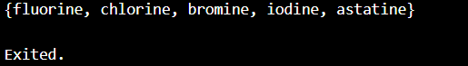
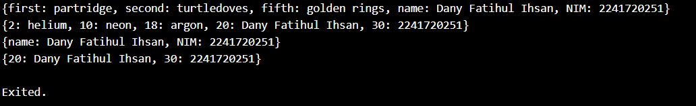

# Nama: Dany Fatihul Ihsan
# Kelas: TI-3B
# No. Absen: 06

# 04 | Pengantar Bahasa Pemrograman Dart - Bagian 3
## Praktikum 1: Eksperimen Tipe Data List
### Langkah 1
Ketik atau salin kode program berikut ke dalam void main().
```dart
var list = [1, 2, 3];
assert(list.length == 3);
assert(list[1] == 2);
print(list.length);
print(list[1]);

list[1] = 1;
assert(list[1] == 1);
print(list[1]);
```

### Langkah 2
Silakan coba eksekusi (Run) kode pada langkah 1 tersebut. Apa yang terjadi? Jelaskan!


> Yang terjadi adalah menghasilkan output dari 3 2 1 dikarenakan di array list terdapat 1,2,3 tetapi untuk list 1 yang diprint adalah kebalikannya yaitu 3.

### Langkah 3
Ubah kode pada langkah 1 menjadi variabel final yang mempunyai index = 5 dengan default value = null. Isilah nama dan NIM Anda pada elemen index ke-1 dan ke-2. Lalu print dan capture hasilnya.

Apa yang terjadi ? Jika terjadi error, silakan perbaiki.
> Jawab: menggunakan langkah 1 error yaitu not true.

```dart
void main() {
  final List<String?> list = List.filled(5, null);
  
  list[0] = "Dany Fatihul Ihsan";
  list[1] = "2241720251";
  
  print(list);
}

```


## Praktikum 2: Eksperimen Tipe Data Set
### Langkah 1
Ketik atau salin kode program berikut ke dalam fungsi main().
```dart
var halogens = {'fluorine', 'chlorine', 'bromine', 'iodine', 'astatine'};
print(halogens);
```

### Langkah 2
Silakan coba eksekusi (Run) kode pada langkah 1 tersebut. Apa yang terjadi? Jelaskan! Lalu perbaiki jika terjadi error.

> Yang terjadi adalah menghasilkan yang terdapat di halogens

### Langkah 3
Tambahkan kode program berikut, lalu coba eksekusi (Run) kode Anda.

```dart
var names1 = <String>{};
Set<String> names2 = {}; // This works, too.
var names3 = {}; // Creates a map, not a set.

print(names1);
print(names2);
print(names3);
```

Apa yang terjadi ? Jika terjadi error, silakan perbaiki namun tetap menggunakan ketiga variabel tersebut. Tambahkan elemen nama dan NIM Anda pada kedua variabel Set tersebut dengan dua fungsi berbeda yaitu .add() dan .addAll(). Untuk variabel Map dihapus, nanti kita coba di praktikum selanjutnya.

Dokumentasikan code dan hasil di console, lalu buat laporannya.

```dart
void main() {
  var names1 = <String>{};
  Set<String> names2 = {};

  names1.add("Dany Fatihul Ihsan");
  names1.add("2241720251");

  names2.addAll({"Dany Fatihul Ihsan", "2241720251"});

  // Mencetak hasil
  print(names1);
  print(names2);
}
```


## Praktikum 3: Eksperimen Tipe Data Maps
### Langkah 1
Ketik atau salin kode program berikut ke dalam fungsi main().
```dart
var gifts = {
    // Key:    Value
    'first': 'partridge',
    'second': 'turtledoves',
    'fifth': 1
  };

  var nobleGases = {
    2: 'helium',
    10: 'neon',
    18: 2,
  };

  print(gifts);
  print(nobleGases);
```

### Langkah 2
Silakan coba eksekusi (Run) kode pada langkah 1 tersebut. Apa yang terjadi? Jelaskan! Lalu perbaiki jika terjadi error.


### Langkah 3
Tambahkan kode program berikut, lalu coba eksekusi (Run) kode Anda.
```dart
var mhs1 = Map<String, String>();
gifts['first'] = 'partridge';
gifts['second'] = 'turtledoves';
gifts['fifth'] = 'golden rings';

var mhs2 = Map<int, String>();
nobleGases[2] = 'helium';
nobleGases[10] = 'neon';
nobleGases[18] = 'argon';
```

Apa yang terjadi ? Jika terjadi error, silakan perbaiki.
> tidak terjadi error tetapi belum mengerluarkan output yang diproses di gifts and nobleGases


Tambahkan elemen nama dan NIM Anda pada tiap variabel di atas (gifts, nobleGases, mhs1, dan mhs2). Dokumentasikan hasilnya dan buat laporannya!

```dart
void main() {
  var gifts = {
    // Key:    Value
    'first': 'partridge',
    'second': 'turtledoves',
    'fifth': 'golden rings',
    'name': 'Dany Fatihul Ihsan',
    'NIM': '2241720251'
  };

  var nobleGases = {
    2: 'helium',
    10: 'neon',
    18: 'argon',
    20: 'Dany Fatihul Ihsan',
    30: '2241720251'
  };

  print(gifts);
  print(nobleGases);

  var mhs1 = Map<String, String>();
  mhs1['name'] = 'Dany Fatihul Ihsan';
  mhs1['NIM'] = '2241720251';

  var mhs2 = Map<int, String>();
  mhs2[20] = 'Dany Fatihul Ihsan';
  mhs2[30] = '2241720251';

  print(mhs1);
  print(mhs2);
}
```
hasilnya 


## Praktikum 4: Eksperimen Tipe Data List: Spread dan Control-flow Operators
### Langkah 1
Ketik atau salin kode program berikut ke dalam fungsi main().
```dart
var list = [1, 2, 3];
var list2 = [0, ...list];
print(list1);
print(list2);
print(list2.length);
```

### Langkah 2:
Silakan coba eksekusi (Run) kode pada langkah 1 tersebut. Apa yang terjadi? Jelaskan! Lalu perbaiki jika terjadi error.
> terjadi error dikareankan list1 undifined name lalu list1 saya ganti menjadi list dikarenakan suda terdifine.


### Langkah 3
Tambahkan kode program berikut, lalu coba eksekusi (Run) kode Anda.
```dart
list1 = [1, 2, null];
print(list1);
var list3 = [0, ...?list1];
print(list3.length);
```

Apa yang terjadi ? Jika terjadi error, silakan perbaiki.
yang terjadi error dikarenakan list 1 belum dideklarasi sehingga sebelum list 1 ditambahkan (var)


Tambahkan variabel list berisi NIM Anda menggunakan Spread Operators. Dokumentasikan hasilnya dan buat laporannya!
```dart
void main() {
  var list = [1, 2, 3];
  var list2 = [0, ...list];
  print(list); // Output: [1, 2, 3]
  print(list2); // Output: [0, 1, 2, 3]
  print(list2.length); // Output: 4

  var list1 = [1, 2, null];
  print(list1); // Output: [1, 2, null]
  var list3 = [0, ...?list1];
  print(list3.length); // Output: 4

  var nimList = [2, 2, 4, 1, 7, 2, 0, 2, 5, 1];
  var combinedList = [...nimList, ...list3];
  print(combinedList);
  print(combinedList.length);
}
```

> NIM 2241720251 telah berhasil ditambahkan ke dalam list menggunakan Spread Operator. List yang dihasilkan menggabungkan digit-digit NIM dengan elemen dari list lain, dan panjang list sesuai dengan jumlah total elemen.

### Langkah 4
Tambahkan kode program berikut, lalu coba eksekusi (Run) kode Anda.
```dart
var nav = ['Home', 'Furniture', 'Plants', if (promoActive) 'Outlet'];
print(nav);
```
Apa yang terjadi ? Jika terjadi error, silakan perbaiki. Tunjukkan hasilnya jika variabel promoActive ketika true dan false.

yang terjadi error dikarenakan promoActive belum dideklarasi menjadi boolean.

**Perbaikan**
```dart
bool promoActive = true;
var nav = ['Home', 'Furniture', 'Plants', if (promoActive) 'Outlet'];
print(nav);
```
**Hasilnya**


### Langkah 5
Tambahkan kode program berikut, lalu coba eksekusi (Run) kode Anda.
```dart
var nav2 = ['Home', 'Furniture', 'Plants', if (login case 'Manager') 'Inventory'];
print(nav2);
``` 
Apa yang terjadi ? Jika terjadi error, silakan perbaiki. Tunjukkan hasilnya jika variabel login mempunyai kondisi lain.
> terjadi error dikarenakan login belum di deklarasi sehingga memicu error


### Langkah 6
Tambahkan kode program berikut, lalu coba eksekusi (Run) kode Anda.
```dart
var listOfInts = [1, 2, 3];
var listOfStrings = ['#0', for (var i in listOfInts) '#$i'];
assert(listOfStrings[1] == '#1');
print(listOfStrings);
```
Apa yang terjadi ? Jika terjadi error, silakan perbaiki. Jelaskan manfaat Collection For dan dokumentasikan hasilnya.
> tidak terjadi error. Manfaat menggunakan Collection For untuk mengubah elemen dari listOfInts menjadi string dan menyimpannya di listOfStrings.


## Praktikum 5: Eksperimen Tipe Data Records
### Langkah 1
Ketik atau salin kode program berikut ke dalam fungsi main().
```dart
var record = ('first', a: 2, b: true, 'last');
print(record)
```

### Langkah 2
Silakan coba eksekusi (Run) kode pada langkah 1 tersebut. Apa yang terjadi? Jelaskan! Lalu perbaiki jika terjadi error.
> tidak terjadi error di code.


### Langkah 3
Tambahkan kode program berikut di luar scope void main(), lalu coba eksekusi (Run) kode Anda.
```dart
(int, int) tukar((int, int) record) {
  var (a, b) = record;
  return (b, a);
}
```

Apa yang terjadi ? Jika terjadi error, silakan perbaiki. Gunakan fungsi tukar() di dalam main() sehingga tampak jelas proses pertukaran value field di dalam Records.
> yang terjadi sama hasilnya sama seperti langkah 1 dan tidak terjadi error di output tetapi jika ingin memnggunakan fungsi tukar() didalam main maka yang b: boolean harus diganti menjadi int.
```dart
(int, int) tukar((int, int) record) {
  var (a, b) = record;
  return (b, a);
}

void main() {
  var record = (2, 5);
  print(record);

  var result = tukar(record);
  print(result);
}
```


### Langkah 4
Tambahkan kode program berikut di dalam scope void main(), lalu coba eksekusi (Run) kode Anda.

```dart
// Record type annotation in a variable declaration:
(String, int) mahasiswa;
print(mahasiswa);
```
Apa yang terjadi ? Jika terjadi error, silakan perbaiki. Inisialisasi field nama dan NIM Anda pada variabel record mahasiswa di atas. Dokumentasikan hasilnya dan buat laporannya!
> terjadi error dikarenakan Variabel mahasiswa dideklarasikan sebagai record (String, int), tetapi tidak diinisialisasi dengan nilai apa pun.

**Perbaikan**
```dart
(int, int) tukar((int, int) record) {
  var (a, b) = record;
  return (b, a);
}

void main() {
  (String, int) mahasiswa = ('Dany Fatihul Ihsan', 2241720251); 
  print(mahasiswa);

  var record = (2, 5);
  print(record);

  var result = tukar(record);
  print(result);
}
```
**Hasil**


### Langkah 5
Tambahkan kode program berikut di dalam scope void main(), lalu coba eksekusi (Run) kode Anda.
```dart
var mahasiswa2 = ('first', a: 2, b: true, 'last');

print(mahasiswa2.$1); // Prints 'first'
print(mahasiswa2.a); // Prints 2
print(mahasiswa2.b); // Prints true
print(mahasiswa2.$2); // Prints 'last'
```
Apa yang terjadi ? Jika terjadi error, silakan perbaiki. Gantilah salah satu isi record dengan nama dan NIM Anda, lalu dokumentasikan hasilnya dan buat laporannya!

> tidak terjadi error
```dart
void main() {
  (String, int) mahasiswa = ('Dany Fatihul Ihsan', 2241720251);
  print(mahasiswa);

  var record = (2, 5);
  print(record);

  var result = tukar(record);
  print(result);

  var mahasiswa2 = ('first: Dany Fatihul Ihsan', a: 2241720251, b: true, 'last');

  print(mahasiswa2.$1);
  print(mahasiswa2.a);
  print(mahasiswa2.b);
  print(mahasiswa2.$2);
}

```

## Tugas Praktikum
1. Silakan selesaikan Praktikum 1 sampai 5, lalu dokumentasikan berupa screenshot hasil pekerjaan Anda beserta penjelasannya!
> Sudah

2. Jelaskan yang dimaksud Functions dalam bahasa Dart!
> Functions adalah blok kode yang bisa dieksekusi ketika dipanggil, biasanya digunakan untuk mengatur ulang kode yang berulang dan meningkatkan modularitas.

3. Jelaskan jenis-jenis parameter di Functions beserta contoh sintaksnya!
> Positional Parameters, Named Parameters, dan Optional Positional Parameters. Contoh: 
```dart
void sayHello([String? name]) {
  if (name != null) {
    print('Hello, $name!');
  } else {
    print('Hello!');
  }
}
```

4. Jelaskan maksud Functions sebagai first-class objects beserta contoh sintaknya!
> Disimpan dalam Variabel, Diberikan sebagai argumen ke fungsi lain, dan dikembalikan sebagai nilai dari fungsi. Contoh:
```dart
void fungsiCetak(String message) {
  print(message);
}

void eksekusiFungsi(void Function(String) f, String msg) {
  f(msg);
}

void main() {
  var myFunc = fungsiCetak;
  eksekusiFungsi(myFunc, "Hello Dart!");
}
```

5. Apa itu Anonymous Functions? Jelaskan dan berikan contohnya!
> fungsi yang tidak memiliki nama dan biasanya didefinisikan langsung di tempat digunakan, sering digunakan dalam pemrosesan callback atau koleksi. Contoh:
```dart
var list = ['Alice', 'Bob', 'Charlie'];
list.forEach((name) {
  print('Hello, $name!');
});
```

6. Jelaskan perbedaan Lexical scope dan Lexical closures! Berikan contohnya!
> Lexical Scope: Merupakan ruang lingkup dimana variabel dapat diakses berdasarkan posisi kode dalam struktur. Contoh:
```dart
void main() {
  var x = 10;
  void printX() {
    print(x); // x dapat diakses karena berada dalam lexical scope yang sama
  }
  printX();
}
```
> Lexical Closures: Mengacu pada fungsi yang menangkap variabel dari konteks lingkup di mana mereka didefinisikan, bahkan setelah lingkup itu selesai dieksekusi. Contoh:
```dart
Function makeAdder(int addBy) {
  return (int i) => addBy + i;
}

void main() {
  var add2 = makeAdder(2);
  print(add2(3)); // Output: 5
}
```

7. Jelaskan dengan contoh cara membuat return multiple value di Functions!
```dart
(int, String) getInfo() {
  return (42, 'Dart');
}

void main() {
  var (number, language) = getInfo();
  print('Number: $number, Language: $language');
}
```

8. Kumpulkan berupa link commit repo GitHub pada tautan yang telah disediakan di grup Telegram!
> Tidak ada Grup Telegram