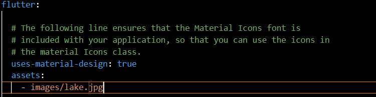

# Dany Fatihul Ihsan
# TI3B / 06
# 2241720251
# layout_flutter

A new Flutter project.

## Getting Started

## Praktikum 1: Membangun Layout di Flutter
### Langkah 1
Buatlah sebuah project flutter baru dengan nama layout_flutter. Atau sesuaikan style laporan praktikum yang Anda buat.

### Langkah 2
Buka file main.dart lalu ganti dengan kode berikut. Isi nama dan NIM Anda di text title.

### Langkah 3
Identifikasi layout diagram

### Langkah 4
Implementasi title Row

## Praktikum 2: Implementasi button row
### Langkah 1
Membuat method buildbuttoncolumn

### Langkah 2
Membuat widget buttonsection

### Langkah 3
Menambahkan button section ke body

## Praktikum 3: Implementasi Text Section
### Langkah 1
Membuat widget text section

### Langkah 2
Tambahkan variabel text section ke body\

## Praktikum 4: Implementasi image section
### Langkah 1
menyiapkan aset gambar

### Langkah 2
menambahkan gambar ke body

### Langkah 3
mengubah body column menjadi listview
