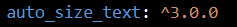
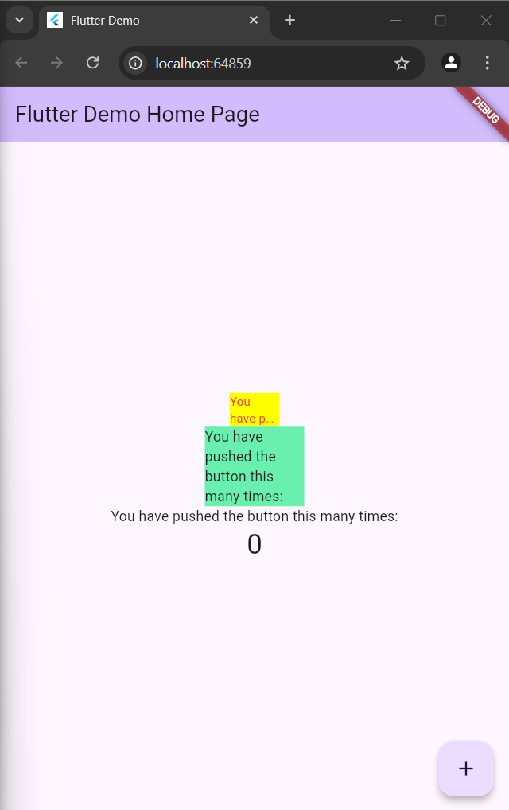
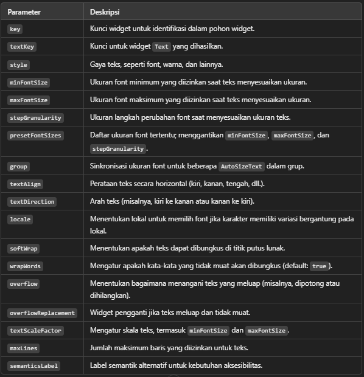

# flutter_plugin_pubdev

A new Flutter project.

## Getting Started

# Dany Fatihul Ihsan
# TI3B
# 06

## Praktikum Menerapkan Plugin di Project Flutter
### Langkah 1
Buatlah sebuah project flutter baru dengan nama flutter_plugin_pubdev. Lalu jadikan repository di GitHub Anda dengan nama flutter_plugin_pubdev.

### Langkah 2
Tambahkan plugin auto_size_text menggunakan perintah berikut di terminal

```text
flutter pub add auto_size_text
```
hasilnya akan muncul di pubspec.yaml, seperti ini


### Langkah 3
Buat file baru bernama red_text_widget.dart di dalam folder lib lalu isi kode seperti berikut.
```text
import 'package:flutter/material.dart';

class RedTextWidget extends StatelessWidget {
  const RedTextWidget({Key? key}) : super(key: key);

  @override
  Widget build(BuildContext context) {
    return Container();
  }
}
```

### Langkah 4
Masih di file red_text_widget.dart, untuk menggunakan plugin auto_size_text, ubahlah kode return Container() menjadi seperti berikut.
```text
return AutoSizeText(
      text,
      style: const TextStyle(color: Colors.red, fontSize: 14),
      maxLines: 2,
      overflow: TextOverflow.ellipsis,
);
```
Setelah Anda menambahkan kode di atas, Anda akan mendapatkan info error. Mengapa demikian? Jelaskan dalam laporan praktikum Anda!

terjadi error karena text tidak deklarasi di constructor

### Langkah 5
Tambahkan variabel text dan parameter di constructor seperti berikut.

```text
final String text;

const RedTextWidget({Key? key, required this.text}) : super(key: key);
```

### Langkah 6
Buka file main.dart lalu tambahkan di dalam children: pada class _MyHomePageState
```text
Container(
   color: Colors.yellowAccent,
   width: 50,
   child: const RedTextWidget(
             text: 'You have pushed the button this many times:',
          ),
),
Container(
    color: Colors.greenAccent,
    width: 100,
    child: const Text(
           'You have pushed the button this many times:',
          ),
),
```
Hasilnya Seperti ini



## Tugas Praktikum
1. Selesaikan Praktikum tersebut, lalu dokumentasikan dan push ke repository Anda berupa screenshot hasil pekerjaan beserta penjelasannya di file README.md!

2. Jelaskan maksud dari langkah 2 pada praktikum tersebut!
Jawab: untuk menambahkan paket auto_size_text ke dalam proyek Flutter Anda. Paket ini berguna untuk membuat teks secara otomatis menyesuaikan ukuran font-nya agar pas di dalam suatu ruang atau widget, tanpa memotong teks. 

3. Jelaskan maksud dari langkah 5 pada praktikum tersebut!
Jawab: Kode di atas mendefinisikan widget bernama RedTextWidget. Tujuan widget ini adalah untuk menampilkan teks dengan warna merah. Teks yang ditampilkan diterima dengan properti teks, yang bersifat definitif sehingga nilainya tidak dapat diubah setelah dimulai. Saat widget dibuat, konstruktor bertipe const memastikan bahwa widget dapat dioptimalkan dan parameter teks harus diisi. Menurut metode build, teks akan ditampilkan dalam widget Text dengan gaya warna merah.

4. Pada langkah 6 terdapat dua widget yang ditambahkan, jelaskan fungsi dan perbedaannya!
Jawab: Container pertama fokus pada gaya teks (warna merah). Sedangkan Container kedua hanya menggunakan teks bawaan tanpa pengaturan warna khusus.

5. Jelaskan maksud dari tiap parameter yang ada di dalam plugin auto_size_text berdasarkan tautan pada dokumentasi ini !


6. Kumpulkan laporan praktikum Anda berupa link repository GitHub kepada dosen!